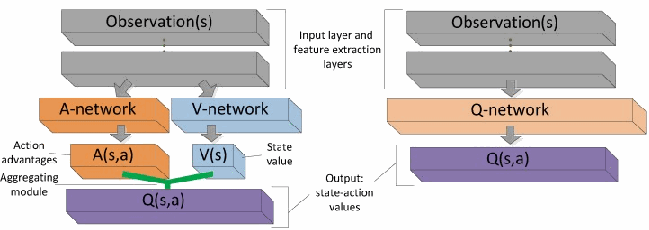
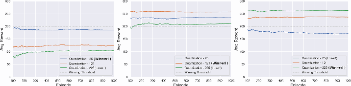
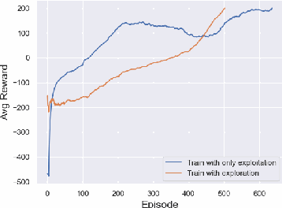

**Note: This document was automatically converted from a PDF to Markdown by an LLM. For the most accurate formatting and content, please refer to the [original PDF](./Final%20Project.pdf).**

# Reinforcement Learning - Final Course Project

**Authors:** Stav Yosef (ID: 316298876), Dan Botchan (ID: 200967941)  
**Course:** Reinforcement Learning, IDC, 2021

---

## 1. Introduction
Reinforcement learning is a sub-field of machine learning, which deals with
training a machine to make a sequence of decisions in order to solve a given
task. More specifically, in RL we try to teach an agent to achieve a goal in an
uncertain environment, by negative or positive feedback he receives from the
environment based on the actions he takes. Those feedback are called rewards
andtheagentisaskedtomaximizethetotalcumulativefuturerewards. Inthis
project, we would explore a variety of algorithms that we learned during the
course,withthegoaloftrainingagentstocompletetwotypesofgames: Sokoban
and Lunar Lander (LL). We will start with one of the biggest breakthroughs of
thisfield, DeepQ-Networks, developedbyDeepMindteamon2015[1]. Wewill
use the DQN as a baseline test of the effect of the Replay Memory, which was
also addressed by DeepMind, the effect that hand-crafted features may have,
and the importance of exploration during the learning stage. Then, we will try
to improve our results using algorithms that followed DQN, such as Dueling
DQN, also developed by DeepMind [2] and Soft Actor-Critic [3]. By the end
of this project, we hope to be able to land a ship on the moon and to arrange
boxes in the right place.

## 2. Related Works
Sokoban is a kind of a logic puzzle, with seemingly simple rules, but still con-
stitutes difficulties for both humans and computers in solving the game. It can
be considered as an NP-Hard search problem [4][5][6], for which the difficulty
of the problem varies with the map’s size, the number of boxes, and the re-
strictions given to players – such as the ability to pull. A variety of methods
suchasbrute-force,BFS,DFS,hashingtables,FEEsandetc. [4]seemstosolve
only a subset of the puzzles but are constrained by time and computational
complexity. The learning process of reinforcement algorithms may results in an
enormous number of times that the agents fail to complete the task, which in
real life can cause high development costs, therefore video games are a great
controlled environment for RL. DeepMind’s team amazed the world of RL with
the DQN [1], which was the first method to allow non-task-specific learning
of games based on high-level features, and not hand-crafted features or labels.

They used deep neural networks combined with Q-learning to approximate the
value-actionfunction. Theyalsointegratedtheexperiencereplay(byLin[7]),a
techniquetoallowbatchupdatesfromsampledtransitionsanddealingwiththe
problem of correlated states that interfere with the generalization of the model.
Another work by DeepMind’s team is the Dueling-DQN [2], an improvement of
the DQN. They show that as with other Q-learning algorithms, the DQN also
tends to overestimate the value-action, which can fail the agent. They tackle
the problem by separating the function into two different functions one for the
statevaluefunctionandoneforthestate-dependentactionadvantagefunction.
By doing so, they achieves improvement both in results and in the training
process, with faster convergence and training stability [8]. Another RL method
is the Actor-Critic that introduces us to a policy gradient normalization by
subtracting the mean baseline [8]. Berkeley’s team suggested Soft Actor-Critic
analgorithmforcontinuousactionspace(ourLLenvironment), whichaddsen-
tropyregularization,thatshouldhelpthemodellearnwhilekeepingexploration
high. And also incorporate improved architecture for dealing with overestima-
tions[9]. Inourwork, wewillusethemethodsdescribedabovetotryandsolve
the Sokoban and LL.

## 3. Solution
### 3.1 General approach
Both Sokoban and Lunar Lander (LL) hold the Markov Property and therefore
justify the use of RL. Sokoban has an enormous number of states which vary in
the different versions [4], so value iteration methods are not an option and LL
hasinfinitystates. Sokoban’smodeltransitionisknownbecauseeachactionwill
lead to a deterministic state. The game on one hand is episodic, but the algo-
rithmsrarelyreachaterminalstate,soalgorithmsbasedonTemporalDifference
(TD) are preferred. We will start by examining Q-Learning algorithms which
are off-policy, iteratively update learners. Due to the number of states in each
game, we will use neural networks to approximate the action-value function in-
steadofthetabularmethod. WewilluseDQNasourstartingalgorithm. DQN
meets our needs. It is easy to implement, it is based on Bellman-Equation and
TD logic, and it’s robust to different games, it is also model-free, which means
we don’t need to have any transition model (even though we know it) [1]. On
theDQNitwillbeeasytoadjustandexperimenttheeffectofhyperparameters
ontheresults, theeffectoftheexperiencememory,whichcanadvantageusdue
to the off-policy nature of the DQN [8], and the effect of changing the rewards
based on hand-crafted features.

### 3.2 Design
All of our solutions are written with Python 3.8.10 using PyTorch library and
the game’s environments based on the Gym toolkit created by OpenAI. Run
both on PyCharm (2021.2) and Google Colab.

#### 3.2.1 Estimated action-value evaluation
This metric was suggested by DeepMind [1]. It keeps a random set of obser-
vations and then calculates the square of the mean of the expected estimated
rewardsforthissetaccordingtothetrainedagent. Thismetricisallegedlymore
stable, and we hope it might assist us to understand whether the agent learns
the Sokoban environment despite the low score caused by the sparse rewards.

#### 3.2.2 DQN and Dueling DQN
DQN and Dueling DQN architecture are similar, as shown in Figure 1. Both
networks have the same input and feature extraction module. In Sokoban, we
usedCNNwhileonLLweusedfully-connectedarchitecturewithastate’stuple
(s ∈ R8) as the input. The outputs are state-action values. The difference is
that the DQN has a single sequence network and it directly produces Q-values
estimation and the dueling network uses two sequences (streams) networks to
estimate state values and action advantages, and then combines them to indi-
rectly generate the Q-values with the following equation:
$$Q(s,a;θ)=V (s;θ)+ (A(s,a;θ)− \frac{1}{|A|}(\sum_{a^`} A(s,a^`;θ))$$

Figure 1: Dueling DQN (left) and DQN (right).

 [9]
OurLLiscontinuous, thenwhenwetriedtofetchasimpleDQNwefaceda
problem with the output of the network. Hence a simple solution is to perform
quantization and mapping on the input. We’ll explain the process using an
example. Our action space is $[x,y],x,y ∈R^2$ where $−1≤x,y ≤1$,then perform
a quantization, in section 3 we’ll see different results for different quantization
sizes. For this example assume our size is 5. Therefore from continuous value,
we transform to $[−1,−0.5,0,0.5,1]$ values (we are choosing the one that is the
closest to the real value). With mapping, we map each of the possible actions
into a single integer, in this case, $5^2 = 25$ possible actions. To achieve a legit
action from the network to our lunar we just need to perform a simple reverse
mapping of the mapping we mentioneda bove. When it comes to Loss functions
we chose to work with SmoothL1Loss [10] in PyTorch library which is similar
to Huber Loss [11], it is less sensitive to outliers than the famous MSE and
can prevent exploding gradients. For optimizers we tried SGD, RMSProp and
Adam for training Sokoban, but due to the sparsity of the rewards, the results
were unclear so we decided to go with Adam because it has the properties of
RMSprop [12].

#### 3.2.3 Soft Actor-Critic
In the previous architectures, we had to manipulate the action space because
those architectures can handle only discrete action space, this is where Soft
Actor-Critic (SAC) comes in. SAC can handle continuous action space. The
biggestadvantageofSACovertheotheralgorithmswehavetestedisthatisnot
onlyseekingtomaximizethefuturerewards, SACseekingtoalsomaximizethe
entropy of the policy. Entropy is measuring how random is a random variable
is. In entropy-regularized RL, the agent gets a bonus reward at each step pro-
portional to the entropy of the policy that can affect exploration exploitation
trade-off, SAC is learning a policy $\pi_\theta$ and two different Q-functions: $Q_{\phi 1}$ and $$Q_{\phi 2}$.

Figure 2: Soft Actor-Critic Architecture

In our SAC we have 3 networks. One is the Actor-network which takes in
the current state and outputs the best action to take. The second and third
networksareCriticnetworks,whichtheyaretakinginastateandanactionand
output a state-action value. In contrast to Dueling DQN and DQN, we used
ReLU as the activation function as described in the original paper [3], Adam
as an Optimizer and, MSE as Loss function. Despite the computational power,
the learning is much better, that’s means that the algorithm generalizes the
problem better than the other algorithms we have tested.

## 3. Experimental results
### 3.1. Lunar Lander
First, we want to show a short video of our best results. In the following video,
we show a SAC model before training (randomized weights), after 120 episodes
of training, after 240 episodes (environment solved), and after 360 episodes.
Link, https://youtu.be/Pn760rYQvmc
#### 3.1.1. DQN
We started LL experiments with DQN. We performed 6 different quantizations
{25, 49, 81, 121, 169, 225} (chose to display only subset), to check the affect
it has on speed of convergence. We also, tested on varianet of network depths.
The full results can be found in the GitHub repository [13].
Figure 3:

 From left to right, (a) 2-layers depth. (b) 3-layers depth (c) 4-layers
depth.
From Fig. 3, we can see interesting phenomenon, where in (a) the lowest
quantization is the only one to finish, but the results alternated when we added
layers. We conclude that with only 2 layers it is harder for the algorithm to generalize on large number of actions. We suggest that more layers are needed for
generalization. We performed another test to check this statement, by running
thousand episodes with each of the trained models.
Figure 4:

 From left to right, (a) 2-layers depth (b) 3-layers depth (c) 4-layers
depth.
We can see at Fig4 (a) that the algorithm is indeed failed to generalized and
all quantization are below 200 average reward. In (b) 3 layers with 121 actions
gets the best fit and achieve more than 250 average scores over 1000 episodes.
Another interesting experiment we did is to check how important is the use
of exploration. In our experiments we used epsilon-greedy with epsilon decay
and we wanted to test what happens if we use only exploitation (Figure 5).
We can see the impact of the ex-
ploration. It almost seems to learn
the game faster, but we notice that it
gotstuckinsomepointandoscillates
aroundthevalueof150averagescore.
When using exploration, the process
of learning seems a bit slower, but
thecurveimprovesmonotonicallyand
surpassing the non-exploration pro-
cess. Nicetoseethatthisexperiment
confirm what we learned during the
courseabouttheimportanceofexplo-
ration.
Figure 5: Exploitation and Exploration

#### 3.1.2 Dueling DQN
The results of Dueling DQN experi-
ments are pretty similar to what we
saw in DQN above. Hence we will show only the results with 3 layers.
(a) Training with Dueling DQN. (b) Testing with Dueling DQN.
Hyperparameter Value Hyperparameter Value
Episodes 1000 Max Steps 500
Gamma 0.99 Learning Rate 0.0005
Epsilon Start 1 Epsilon End 0.05
Table 1: Important Hyperparameters.
We can see in Table 1 the important hyperparameters that we found, the
full list of hyperparameters can be found in the GitHub repository [13].

#### 3.1.3 Soft Actor-Critic
The results of the experiments were
differentfromtheexperimentsinDu-
elingDQNandDQN,notonlybythe
results but also in the way that the
algorithm learns this game. The best
result we have seen is as Fig. 7 but a
lot of time with the same setting the
algorithm solved this game with 450-
500episodeswhichisabigdifference.
Another big disadvantage for this al-
gorithm is the time of training that
can be range from 30 minutes to an
hour. Most of our experiments focus
Figure 7: Training a SAC model.
on the temperature parameter α that
controls the exploration-exploitation
trade-off, we found that the best fit α is 0.2. The other hyperparameters were
like in the original paper [3].
3.2 Sokoban
During the experiments, we notice that the rewards are sparse and for 500
episodes, solving the episode is almost random. We needed metrics to gain
some information from the grid search. At first, we thought about taking the
top 5 episodes, but the game rarely finishes so, this is still random. We decided
to go with the average of the last 100 episodes.
3.2.1 Optimizer choosing
As part of our grid search effort, we tried to test most of the hyperparameters
witheachofthethreeoptimizers: SGD,RMSProp,andAdam. Asweexplained,
results are close to random, and therefore impossible to tell the impact. We
decided to continue our experiments using Adam.
7

---

Optimizer LR* MC** Batch Size Filters TU*** AVG Score
SGD 0.0001 1 1 [16, 32] 5 0.130
RMSProp 0.0001 1 1 [16, 32] 5 0.876
Adam 0.0001 1 1 [16, 32] 5 0.314
SGD 0.001 100 20 [16, 32] 5 0.070
RMSProp 0.001 100 20 [16, 32] 5 0.430
Adam 0.001 100 20 [16, 32] 5 0.757
Table 2: *Learning Rate, **Memory Capacity, ***Target Update
3.2.2 Hyperparameters Grid Search
For each of the hyperparameters, we tried three different values. We tested:
learning rate, memory capacity, batch size, number of filters for each layer, and
number of episodes until the update of the target network. Unfortunately, we
weren’t able to draw any conclusions from the results which seems random.
Probably a lot more episodes are needed to better understand if we’re in the
right direction.

Condition,Learning Rate,MC*,Batch Size,Filters,TU**,AVG Score
No Experience Replay,0.01,1,1,"[32, 64]",5,0.745
,0.001,1,1,"[32, 64]",5,0.828
,0.0001,1,1,"[32, 64]",5,0.296
,0.0001,1,1,"[16, 32]",5,0.314
Experience Replay,0.01,100,20,"[16, 32]",5,0.495
,0.001,100,20,"[16, 32]",5,0.757
,0.001,100,20,"[32, 64]",5,0.809
,0.0001,100,20,"[32, 64]",5,0.431
,0.01,100,80,"[16, 32]",5,0.599
,0.001,100,80,"[16, 32]",5,0.318
,0.01,2000,20,"[16, 32]",5,0.276
,0.001,2000,20,"[16, 32]",5,0.653
,0.001,2000,80,"[16, 32]",5,0.338
,0.0001,2000,80,"[16, 32]",5,0.348
,0.0001,100,20,"[16, 32]",20,1.134
,0.001,100,20,"[32, 64]",20,0.750
,0.0001,100,20,"[32, 64]",20,0.610
,0.01,2000,20,"[16, 32]",20,0.403
,0.001,2000,20,"[16, 32]",20,0.259
,0.0001,2000,20,"[16, 32]",20,0.683
,0.01,2000,80,"[16, 32]",20,0.971
,0.0001,2000,80,"[16, 32]",20,0.645

#### 3.2.3 Hand Crafted Features
After we tested the hyper-parameters we noticed the sparse rewards are not
sufficient for the learning process. We wanted to check whether we can help
the agent finish the game more often, by adjusting the rewards. We defined 3
features: reward the agent for choosing action that results in new state (move-
ment),rewarditforhavingaboxinoneofhisneighboredpixelsandpunishment
for distance between box and a target.
Figure 8: 8 experiments, in each one different flags are True/ False, which
indicates if the feature was part of the training
As we can see, from figure 8, the solving of the puzzle is still rare. Nonethe-
less, based on the graph it seems that crafted features might have impact,
especially the feature of being near boxes. In future work, more reruns of
this experiment are needed, during which, we need to adjust the size of re-
wards/punishmentsforeachoptiontogetabettersenseontheaffectsofreward
adjusting.
9

---

3.2.4 Few words
We’ve implemented the Estimated action-value evaluation in the hope we will
have a more stable indicator for visualizing the learning process. Though that
by this metric the agent does seems to learn. In reality, finishing an episode
andsolvingthetaskwasstillrandom, anditdoesn’tseemtoreallyindicatethe
agent’s understanding of the task as we can see in Figure 9.
Figure 9: Left: The mean Action-Value metric, Right: Score per episode.
10

---

4 Discussion
When we started this project, the task was to solve a more complex version of
Sokoban. Ourresearchwentintwopaths. Thefirstwasareviewofmorerecent
RLupdatesandthesecondwasspecifictoSokobanandhowtosolveit. Wewere
naiveandthoughtDQNwouldbeenoughtosolveit,butveryfastweunderstood
that more complex algorithms are needed. We tried Dulleing DQN and A2C
(Actor-Criticwithadvantages)thatfailed. Sowestartedtocomeupwithmore
creativeideassuchasadjustingrewardsandeventhoughtaboutsolvingSokoban
withBFSandinjectingstepsdiscoveredbyit,totheexperiencememorybuffer.
It was only after a very extensive grid-search and upsetting results, that we
realized that based on the two metrics we use (Mean Action-Value and average
score) it is hard to tell whether the training of Sokoban makes any progress. So
we decided to move on to LL and to try and use the knowledge we gained on
the sokoban. Armed with this knowledge we were able to solve LL much easier
with 3 different architectures. We tested assumptions we learned during the
course about the exploration-exploitation and quantization of continues game’s
input and even solve it with architecture suitable for continuous inputs (SAC)
for comparison.
4.1 Conclusions and Future Work
Inthemakingofthesummarypaper, wetriedtoshowmostofthestageswe’ve
been to, with the logic that lead us in each of them. We tried and tackle
different methods we learn such as experience memory, discount factor, eps-
greedy, quantization and Q-learning algorithms. That gave us some sense of
feeling on how complex is the task of teaching computers to solve and conduct
tasks. The gap between what we see as obvious and our ability to translate it
into instructions that might be beneficial for the agent’s learning process. We
also learned how to make use of GYM environments, and how to implement
PyTorch based RL algorithms. Reflecting the work, it might was a smarter
choice to start with the LL and not the Sokoban because it is clearer whether
the agent learns or not, the run time of the environment is much faster and the
rewards areway lesssparse. Wegotcaughtinthe challengeof theSokbanfora
bittolong. Ifwehadmoretimeandcomputationalpower,wewouldliketotest
thenewmethodbyDeepMind-Imagination-Augmentation[14],whichseemsto
be able to solve the 2-boxes Sokoban by adding a ability of imagination to the
agent which give him the ability to test future trajectories before deciding on a
move.
5 Code
https://github.com/stav95/CourseReinforcementLearning
11

---

References
[1] Volodymyr Mnih et al. “Human-level control through deep reinforcement
learning”. In: Nature 518.7540 (Feb. 2015), pp. 529–533. issn: 1476-4687.
doi:10.1038/nature14236.url:https://doi.org/10.1038/nature14236.
[2] ZiyuWangetal.“DuelingNetworkArchitecturesforDeepReinforcement
Learning”. In: (Apr. 2016). arXiv: 1511.06581 [cs.LG].
[3] TuomasHaarnojaetal.“SoftActor-Critic:Off-PolicyMaximumEntropy
Deep Reinforcement Learning with a Stochastic Actor”. In: (Aug. 2018).
arXiv: 1801.01290 [cs.LG].
[4] Andreas Junghanns and Jonathan Schaeffer. “Sokoban: A Challenging
Single-Agent Search Problem”. In: (1997), pp. 27–36.
[5] YaronShoham and Gal Elidan. “SolvingSokobanwith forward-backward
reinforcement learning”. In: (2021). arXiv: 2105.01904 [cs.LG].
[6] Petr Jarusek and Radek Pel´anek. “Difficulty Rating of Sokoban Puzzle”.
In:FrontiersinArtificialIntelligenceandApplications222(2010).Ed.by
Thomas ˚Agotnes, pp. 140–150. doi: 10.3233/978-1-60750-676-8-140.
url: https://doi.org/10.3233/978-1-60750-676-8-140.
[7] Long-JiLin.“ReinforcementLearningforRobotsUsingNeuralNetworks”.
In: (1992). UMI Order No. GAX93-22750.
[8] Maxim Lapan. Deep Reinforcement Learning Hands-On. Apply Modern
RL Methods, with Deep Q-Networks, Value Iteration, Policy Gradients,
TRPO, AlphaGo Zero and more. Birmingham, UK: Packt Publishing,
2018. 546 pp. isbn: 978-1-78883-424-7.
[9] Menghao Wu et al. “The Actor-Dueling-Critic Method for Reinforce-
ment Learning”. In: Sensors (Basel, Switzerland) 19.7 (Mar. 2019). issn:
1424-8220. doi: 10.3390/s19071547. url: https://europepmc.org/
articles/PMC6479875.
[10] url: https://pytorch.org/docs/stable/generated/torch.nn.
SmoothL1Loss.html.
[11] url: https://en.wikipedia.org/wiki/Huber_loss.
[12] Diederik P. Kingma and Jimmy Ba. “Adam: A Method for Stochastic
Optimization”. In: (2017). arXiv: 1412.6980 [cs.LG].
[13] url: https://github.com/stav95/CourseReinforcementLearning.
[14] Th´eophane Weber et al. “Imagination-Augmented Agents for Deep Rein-
forcement Learning”. In: (2018). arXiv: 1707.06203 [cs.LG].
12